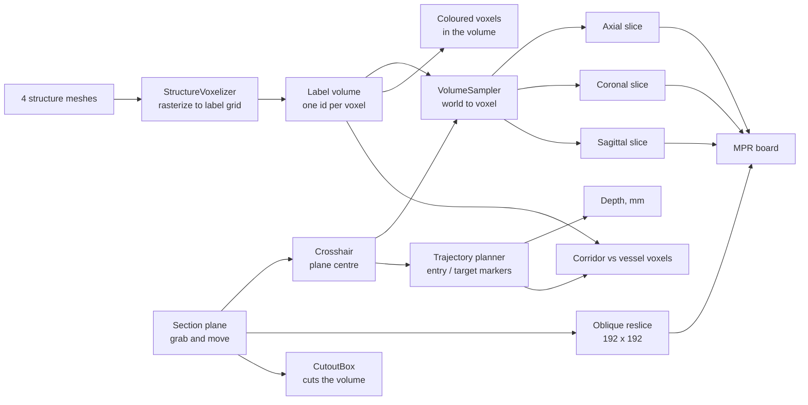

# Brain MRI section explorer

A crosshair-driven explorer for a T1 brain MRI. Move one plane through the head and the axial, coronal and sagittal slices, the oblique cut and the 3D volume all read the same point.

One Unity scene ships as a desktop executable driven by mouse and keyboard, and as a Quest build driven by hand tracking, running on the headset itself or over Link.


-informational)

## Demo

| Walkthrough |
| - |
| [](https://youtu.be/JpZMFiNn8EQ) |
| Slices, structures, trajectory planning and the intensity window, on a Quest 3S |

## Why I built it this way

The obvious way to explore a scan is a viewer with one slider per axis. I did not want three sliders that each move a different thing, because that is not how anyone reads a scan.

Radiology works from a single point. You find something in one plane and you immediately want to know where that same point sits in the other two. So position became the only state in the app. There is one crosshair, it sits at the centre of a plane you can pick up and move, and every view in the scene is a different answer to the same question: what is here?

The three axis slices, the oblique cut and the cross-section of the volume are all readouts of one transform, so they cannot disagree with each other.

## What it does

- Renders the IXI025 T1 MRI as a raymarched volume (UnityVolumeRendering)
- Reslices the voxel grid into axial, coronal and sagittal images that follow the crosshair, each labelled with the slice it is showing
- Cuts the volume with a plane you can move and rotate, and shows that oblique slice as a fourth image
- Keeps the cut facing you, so turning the plane around never buries the exposed face
- Carries skin, gray matter, white matter and veins as labelled voxels inside the scan, coloured in the volume and tinted into every 2D slice, each shown or hidden from a menu
- Plans a straight entry-to-target trajectory, with depth in true patient millimetres and a warning when the track runs through vessel voxels
- Holds the entry point on the scalp and lets you drag it over the skull to hunt for an approach that clears the vessels
- Windows the volume by intensity, the control a radiologist reaches for first, with air excluded whatever the sliders are set to
- Runs on desktop with mouse and keyboard, or on a Quest with hand tracking, from the same scene

## How it works



### 1. One coordinate map

Everything that touches voxels goes through `VolumeSampler`. UnityVolumeRendering draws the dataset into a unit cube spanning -0.5 to 0.5 in its own local space, so a world point becomes a texture coordinate by inverse-transforming it and shifting by half a unit:

```csharp
Vector3 local = cube.InverseTransformPoint(world);
uvw = local + Vector3.one * 0.5f;
```

Multiply by the grid dimensions and you have a voxel index. Keeping that in one class is what stops the slice views, the cut and the volume from drifting apart, and it is where the structure labels plug in: an intensity lookup and a label lookup at one world position are guaranteed to describe the same voxel.

### 2. The three axis slices

`MprScreens` fills the axial, coronal and sagittal panels from the voxel under the crosshair. The dataset is 256 x 256 x 150, so axial comes out 256 x 256 and coronal and sagittal come out 256 x 150.

The panels are sized by millimetres. IXI025 voxels are 0.9375 x 0.9375 x 1.2 mm, so the scan is 240 x 240 x 180 mm and the coronal and sagittal panels are 4:3 while axial is square. Sizing them 256:150 instead squashed the head by about 22%.

Voxel intensity maps straight to grey, tinted toward a structure's colour where one is labelled. Tinting rather than replacing keeps the intensities readable underneath, which is the point of looking at a slice. The transfer function only shapes the 3D volume: the render is an interpretation, the 2D slices are the evidence.

Each panel prints the slice it is showing, one-based out of the stack depth, the way a viewer prints an image number. Reformatted from one volume there is no stored image to number, so it is the reslice index along the axis that view cuts across.

### 3. The oblique cut

The section plane carries a UnityVolumeRendering `CutoutBox` sized to its own rectangle. The alternative, a `CrossSectionPlane`, cuts an infinite half-space, so anything on the far side of the volume disappears too. A box only removes what sits inside the rectangle you are holding, which reads like a window into the head instead of half a head going missing.

The same plane is swept to produce the oblique image, stepping through the volume with the matrix from `VolumeSampler`:

```csharp
Matrix4x4 toUVW = sampler.WorldToUVW * pose;
Vector3 rowStart  = toUVW.MultiplyPoint3x4(new Vector3(-planeSize * 0.5f, -planeSize * 0.5f, 0f));
Vector3 acrossStep = toUVW.MultiplyVector(new Vector3(step, 0f, 0f));
Vector3 downStep   = toUVW.MultiplyVector(new Vector3(0f, step, 0f));
```

The MPR board's fourth panel draws that same texture, so the 3D cut and the 2D oblique slice can never show something different from each other.

The cutout box is also moved to whichever side of the plane you are standing on each frame, so the open face follows you around.

### 4. Structures as voxels

The four segmentation meshes are rasterized into a single label volume on the MRI's own grid, one integer id per voxel, and handed to UnityVolumeRendering as a secondary volume. The structures are then part of the scan rather than surfaces sitting beside it: they colour the raymarched volume, they tint every 2D slice, and they can be read per voxel.

The mapping needs no calibration. `MeshesRoot` carries the same transform as the volume container, so `VolumeSampler.WorldToUVW` takes a mesh vertex straight to the voxel it falls in — every vein vertex lands in a vein voxel.

Reading a structure as voxels rather than as geometry is what makes the trajectory check answer the surgical question directly: *does this track pass through a vessel*, not *how far is the nearest point on a vessel's surface*. The two differ whenever a vessel is thicker than the corridor being tested.

One voxel holds one id, so overlaps are resolved by write order and vessels are written last. Hiding a structure zeroes its colour rather than its data, so a vessel hidden from view is still there for the corridor check.

The bake depends only on the meshes and the grid, both fixed, so it is stored beside the scan as a gzipped byte per voxel — 353 KB, unpacked at startup. The first run in the editor writes it; every run after that reads it.

The menu is a rail of section tabs on the left with the selected section's contents on the right, so the panel stays one size however many sections it grows.

### 5. Trajectory planning

`TrajectoryPlanner` captures an entry and a target point from the crosshair on two button presses, draws a line between them, and reports the depth in real patient millimetres through `VolumeSampler.PatientDistanceMm`, because the number that matters is how far the instrument actually travels through the patient.

The two markers are children of the volume in the scene. Grab the head and turn it, and the markers, the line and the readout move with it, the same as the meshes and the MRI do. The depth and the vein warning stay correct too: both are patient-space measurements, so they do not change just because the head was picked up and turned.

An entry point only means anything on the surface, so setting one projects it onto the scalp: a ray from the head's centre marches the volume's intensity for the air-to-tissue boundary. It marches inward from outside rather than outward from the centre, so an internal air pocket like a sinus is never mistaken for the outside. The marker is grabbable and stays pinned to that surface while dragged, which turns choosing an approach into sliding a point over the skull.

The safety corridor walks the track through the label volume, sampling the centre line and a ring at the corridor radius:

```csharp
for (int i = 0; i <= steps; i++)
{
    Vector3 p = entry + axis * ((float)i / steps);
    if (IsVein(p)) return (float)i / steps;

    for (int k = 0; k < CorridorSamples; k++)
    {
        float a = k * Mathf.PI * 2f / CorridorSamples;
        if (IsVein(p + (across * Mathf.Cos(a) + up * Mathf.Sin(a)) * radiusWorld)) return (float)i / steps;
    }
}
```

A track driven through a vessel is a hit outright, rather than a distance that happens to be small; the ring is what keeps the corridor honoured for a track that threads close by without touching.

The corridor radius is converted through the track's own world-per-millimetre ratio, the same scale the depth readout uses, so the translucent tube drawn around the track is the tube being tested.

### 6. One pointer, two rigs

Neither input path talks to the tools directly. Both end up driving a Meta Interaction SDK `RayInteractor`, which needs exactly two things: a transform to aim, and an `ISelector` that says when a click happened. A hand ray supplies a wrist pose and a pinch. On desktop, `MousePointer` supplies a screen ray and a mouse button:

```csharp
Ray ray = viewer.ScreenPointToRay(Input.mousePosition);
transform.SetPositionAndRotation(ray.origin, Quaternion.LookRotation(ray.direction));

if (Input.GetMouseButtonDown(0))
    WhenSelected?.Invoke();
```

Everything downstream of the interactor, the buttons, the hover tints, the menus, cannot tell the two apart. `DesktopMode` picks the rig at startup and switches one on and the other off.

Which rig to pick is a timing question. XR Plug-in Management selects its loader before the scene loads, but the OpenXR session only confirms a frame or more later, later still over Link, so a headset is up long before anything reports it as present. Deciding on presence alone would send a real headset to the desktop rig. With no loader at all there is no XR and it commits to desktop immediately, which is the path the graded build takes; with a loader up it starts on the headset and falls back only if the display never begins presenting.

Panels also carry an inert `RayInteractable` over their whole face. It does nothing when selected, but it gives the pointer something to land on, so the ray stays lit while you travel between buttons instead of blinking off over the gaps. On the MPR board that same backdrop also carries `MouseGrabExempt`, so a desktop click on the images reads as pointing, not grabbing. Everywhere else, an empty click on a panel is a deliberate handle: it drags the panel, or on the section plane, sections the volume.

## Running it

### Desktop

Download the build and run `Synav.exe`, or open the project in Unity `6000.4.0f1`, open `Assets/NavianChallenge/Scenes/NavianChallenge_Main.unity` and press Play. No headset needed. The scene detects that there is no XR device and starts the desktop rig.

| Input | Action |
| - | - |
| Right-drag | Look around |
| W A S D | Move |
| Q / E | Down / up |
| Shift | Move faster |
| Wheel | Forward / back |
| Arrow keys | Angle the cut plane |
| Left-click | Press a button |
| Left-drag | Move a panel or the head |
| Wheel while dragging | Push away / pull closer |
| Shift while dragging | Rotate instead of move |
| F | Reset the view |
| H | Hide the on-screen controls |

Start by dragging the section plane into the head. The oblique panel is black until the plane meets the volume. The **Plan** tab (next to **Filter** on the main menu) holds the trajectory tool: Set entry and Set target capture the crosshair's current position, and a slider sets the vein safety-corridor diameter.

### Quest

Turn your left palm towards your face to bring up the wrist menu, which shows and hides the three tools. Buttons take a poke or a point and pinch. Panels are grabbed by their frame with either hand, and the images inside them take a point rather than a grab.

Sideload `Synav.apk` to run it on the headset:

```
adb install -r Synav.apk
```

Or run it over Link: connect the headset, start Link, then press Play in the editor. The same scene serves both, and picks its rig from whether an XR device came up.

### Building it

Built-in pipeline, and the only scene in the build list is `NavianChallenge_Main`.

For desktop, target Windows x64 and `File > Build Settings > Build`. The player opens windowed at 1600 x 900 and is resizable.

For the headset, switch the target to Android, IL2CPP with ARM64 and Vulkan. The two builds are written side by side and share nothing but the scene.

## Repo layout

```
Assets/NavianChallenge/
  Scenes/NavianChallenge_Main.unity   the whole app
  Data/Atlas/IXI025/                  MRI (.nii.gz) + 4 segmentation meshes
    Labels/StructureLabels.bytes      the baked label volume, rebuilt if deleted
  Scripts/
    AtlasSceneController.cs           starter orbit camera, superseded by Desktop/DesktopViewer.cs
    Core/                             works the same regardless of input rig
      VolumeSampler.cs                 world to voxel, the shared coordinate map
      SectionPlane.cs                  binds the cutout, reslices the oblique image
      MprScreens.cs                    the three axis slices + the shared oblique texture
      TrajectoryPlanner.cs             entry/target depth and the corridor check
      DraggableEntry.cs                holds the entry marker on the scalp while it is dragged
      CorridorSlider.cs                drag slider for the corridor diameter
      WindowLevel.cs                   window and level over the volume, air always excluded
      WindowLevelSlider.cs             the two sliders that drive it
      StructureVoxelizer.cs            rasterizes the meshes into the label volume
      StructureToggles.cs              structure visibility
      VolumeStyle.cs                   transfer function applied at runtime
      AtlasVolumeLoader.cs             builds the MRI volume at runtime
    UI/                               interaction primitives both rigs consume
      MainMenu.cs                      sectioned menu (rail on the left, content on the right)
      ButtonSignal.cs                  one press event from poke or ray
      ButtonVisual.cs                  hover and press tint
      DragSlider.cs                    drag behaviour shared by the panel sliders
    Desktop/                          only meaningful without a headset
      DesktopMode.cs                   picks the rig at startup
      DesktopViewer.cs                 desktop camera and on-screen controls
      MousePointer.cs                  screen ray + click, as an ISelector
      MouseGrab.cs                     press and drag panels with the mouse
      MouseGrabExempt.cs               marks a surface MouseGrab should never pick up as a handle
      PlaneRotateInput.cs              arrow keys angle the cut plane
    XR/                               only meaningful with a headset
      WristAnchor.cs                   wrist pose from joint geometry, palm-facing reveal
      WristMenu.cs                     shows and hides the three tools
      Foveation.cs                     shades the periphery of the eye buffer at lower resolution
  Shaders/
    PanelFrame.shader                 SDF rounded frame, stereo instanced
    TrajectoryLine.shader             unlit line drawn on top of the anatomy
    TrajectoryRay.shader              same, with the per-vertex gradient along the track
  Editor/                             one-off scene-building tool, see note below
Assets/ThirdParty/UnityVolumeRendering/
docs/BASE_README.md                   notes that shipped with the starter assets
```

Panels, menus and their frames are authored as real objects in the scene. Scripts hold behaviour only and reference what the scene already contains. Building the UI from code would have meant editing C# to nudge a label 2 mm, which is the wrong tool for that job. The one exception is the two slice textures (`MprScreens`, `SectionPlane`): their pixels come from voxel data, so there is nothing to author.

`Editor/ChallengeSceneBuilder.cs` procedurally rebuilds `AtlasRoot` from the raw `.obj`/`.nii.gz` assets. Nothing in the workflow depends on it. Do not re-run it: it rebuilds the anatomy root from scratch and would discard the alignment and any scene edits made since.

## Technical decisions

**All world to voxel maths in one class.** Slice extraction, the oblique reslice and the cut all read `VolumeSampler`. When registration and region labels land later, they sample the label volume through the same class and everything stays consistent by construction.

**Slices sample nearest-neighbour.** A slice is a texture lookup per pixel and the volume is only 150 slices deep, so nearest neighbour is fast and honest about the source resolution. It does mean the images go blocky when you push a panel close to your face.

**The cut is a bounded box.** An infinite plane takes the far side of the head with it, and cannot show a cut that affects only the region you are pointing at.

**The headset build runs on the Quest itself.** Volume rendering is raymarching: fragment-bound, taking many 3D texture samples per pixel, and stereo doubles the views while raising the framerate target. A desktop GPU over Link absorbs that; a mobile GPU has to be handed less to shade. So the headset build spends its budget on fragments rather than on geometry. The intensity window excludes air, and a sample below the floor stops after one texture read instead of four, which takes most of the volume's bounding box off the expensive path. Foveated rendering shades the periphery of each eye buffer at lower resolution, away from where a slice is being read. The eye buffer is a fixed size rather than one resized against a moving GPU budget, since a buffer that rescales every frame reads as judder more readily than a steady lower framerate does.

**The section plane is the only handle.** There is no separate crosshair object to lose. Moving the thing that cuts is the same gesture as moving the thing that measures.

**Explicit sorting orders on the transparent panels.** Unity sorts transparent geometry by distance to camera, which is unreliable when a panel's backing, image, frame and text sit almost on top of each other. Each layer's draw order is set by hand instead of left to the default.

**The corridor is measured in patient millimetres.** IXI025 voxels are 0.9375 x 0.9375 x 1.2 mm, so a radius taken in world units is wrong by that anisotropy in whichever direction the nearest vessel happens to lie. Converting through `VolumeSampler` sidesteps it instead of correcting for it afterwards.

**Structures are labelled voxels.** A label volume on the scan's own grid answers "what is at this point" for any point, which is what both the corridor check and the slice tinting need. Surfaces answer a different question and have to be intersected to get there.

**The label volume is baked to an artifact.** Its inputs are fixed, so deriving it at startup would repeat the same work forever, and doing it in one frame stalls long enough for an XR compositor to drop the app. It is rasterized once and stored; startup unpacks 353 KB.

**Structure colours are chosen against a greyscale base.** The scan spends the whole lightness range on anatomy, so chroma is the only channel left to separate a label from tissue. Gray and white matter border each other everywhere, so they take opposing warm and cool hues, and keep the one relationship that distinguishes them on a T1: white matter is the brighter of the two.

**Two colour systems, kept apart.** Panel chrome uses a navy/steel/blue palette pulled from Navian's own site. The axial/coronal/sagittal frames use the conventional radiology coding, green/red/blue, and the mesh and trajectory-safety colours are anatomical and status colours. Branding the medical conventions would have made them wrong.

## Known limitations

- **No region naming.** Structures are labelled, anatomical regions are not, so the app cannot name what sits under the crosshair or move the crosshair to a named region. That needs a registered atlas, which this does not ship.
- **Meshes are not clipped by the section plane.** The volume is cut, the meshes render straight through the cut. They need a matching clip plane in their own shader.
- **You cannot click inside a 2D slice to move the crosshair.** The panels are readouts only, so navigation is always through the plane. This is the single biggest gap against a real MPR viewer.
- **The window does not reach the 2D slices.** The volume honours a window and level; the axial, coronal, sagittal and oblique images still map intensity straight to grey across the scan's full range.
- **The 2D panels do not draw the mesh contours.** A real planner outlines the segmentation on every slice.
- **Reslicing runs on the main thread.** A 192 x 192 oblique reslice is recomputed on every plane move. It holds a comfortable framerate at this resolution, but it does not scale to a larger scan or a bigger panel.
- **The wrist menu needs hand tracking.** With controllers in hand it does not appear. The buttons themselves still work by ray.
- **One spatial layout for both builds.** Panel positions were tuned for a standing headset user, and the desktop camera starts where that user's head would be. It works, but a desktop-first layout would put the tools closer together.
- **The section plane starts outside the volume**, so the oblique panel is black until you drag the plane into the head.
- **Structures render at the scan's resolution**, so their edges are 0.94 mm steps rather than smooth surfaces. Label ids cannot be interpolated — a value halfway between two ids is a third structure — so the blockiness is the true resolution of the data rather than something to filter away.
- **The label volume inherits the meshes' segmentation.** It is a rasterization of the structure meshes, so it is exactly as accurate as they are.
- **Structure colours sit at fixed opacities.** The shells in front of the vessels are kept faint so a trajectory stays visible through them, which is a layering compromise rather than a per-view setting.

## What I would add next

In the order I would do them:

1. **Click in a slice to move the crosshair.** Cheapest thing on this list and it closes the largest gap. The panels already know their own voxel mapping.
2. **Offline atlas registration.** Register a labelled atlas (Harvard-Oxford) into IXI025's native grid with ANTsPy or SimpleITK, emit `IXI025_labels.nii.gz` on the same affine plus a `regions.json` of names, synonyms and centroids. The label-volume path it needs already exists — the structures use it — so this adds named anatomical regions to it. Registration stays out of Unity: it is slow, iterative and much better tooled in Python, and the JSON is a seam that lets registration quality improve later without touching app code.
3. **An LLM agent to move the crosshair.** With `regions.json` in place, an agent resolves a typed or spoken request, "show me the left ventricle", "go to the thalamus", against region names, synonyms and descriptions, then moves the crosshair to the matched centroid. The interesting part is robust request understanding, not string equality: an agent handles synonyms, typos and compound descriptions a lookup table can't.
4. **Clip the meshes with the same plane.** One clip plane uniform in the mesh shader, fed from the same transform that drives the cutout.
5. **Carry the window through to the 2D panels**, with trilinear sampling alongside it, which is what makes slices actually readable in a clinical viewer.
6. **Move reslicing off the main thread**, either to a compute shader or the job system, so the panel resolution stops being a framerate decision.

## Credits

MRI and segmentation meshes ship with the starter assets, documented in [docs/BASE_README.md](docs/BASE_README.md). Volume rendering by [UnityVolumeRendering](https://github.com/mlavik1/UnityVolumeRendering). Dataset is IXI025 from the [IXI brain dataset](https://brain-development.org/ixi-dataset/). XR input from the Meta XR All-in-One SDK.
