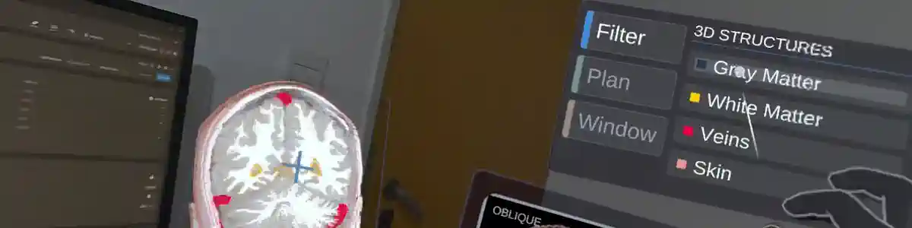
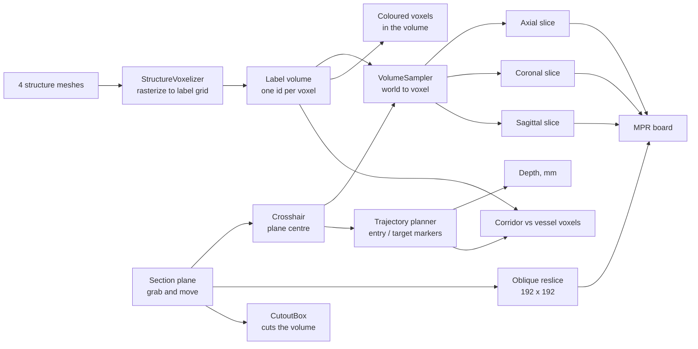

# Synav

A crosshair-driven explorer for a T1 brain MRI. Move one plane through the head; the three axis slices, the oblique cut and the raymarched volume all follow the same point. Plan a trajectory and it reports the depth in patient millimetres and whether the track crosses a vessel.


-informational)

## Video demo

| Walkthrough |
| - |
| [](https://youtu.be/JpZMFiNn8EQ) |
| Slices, structures, trajectory planning and the intensity window, on a Quest 3S |

## Builds

Windows executable and Quest APK: [Google Drive](https://drive.google.com/drive/folders/1loPMYEketRLWhHPjBaNW3xdxENnu0z5K?usp=sharing)

Run `Synav.exe` on desktop, or sideload `Synav.apk` with `adb install -r Synav.apk`. Neither needs the project or the editor.

## Why I built it

A scan is three stacks of images and a pile of segmented surfaces, and most viewers make you drive them separately: one slider per axis, a 3D view in its own mode, meshes sitting beside the scan rather than inside it. That works for reading a study. It works badly for planning, because planning is a question about a *point*: what is here, what surrounds it, and can I reach it without crossing something.

So the app holds one piece of state: the pose of a plane you pick up and move. Every view is a readout of that single transform, so no two of them can disagree.

Segmentation is rasterized into the scan's own voxel grid. That turns "is there a vessel here" into an array lookup rather than a mesh intersection, and it lets one set of data colour the 3D render, tint every 2D slice, and answer the corridor check.

## What it does

- Renders the IXI025 T1 MRI (256 x 256 x 150) as a raymarched volume
- Reslices the grid into axial, coronal and sagittal images that follow the crosshair, each labelled with its slice index
- Cuts the volume with a plane you can move and rotate, and shows that oblique slice as a fourth image
- Keeps the cut facing you, so turning the plane never buries the exposed face
- Carries skin, gray matter, white matter and veins as labelled voxels inside the scan, coloured in the volume and tinted into every slice, each toggled from a menu
- Plans a straight entry-to-target trajectory, reporting depth in patient millimetres and warning when the track crosses vessel voxels
- Pins the entry point to the scalp and lets you slide it over the skull to hunt for a clear approach
- Windows the volume by intensity, with air excluded whatever the sliders say
- Runs on desktop with mouse and keyboard, or on a Quest with hand tracking, from one scene

## How it works



### 1. One coordinate map

Everything that touches voxels goes through `VolumeSampler`. UnityVolumeRendering draws the dataset into a unit cube spanning -0.5 to 0.5 in its own local space. A world point becomes a texture coordinate by inverse-transforming it into that cube and shifting by half a unit:

```csharp
Vector3 local = cube.InverseTransformPoint(world);
uvw = local + Vector3.one * 0.5f;          // 0..1 across the volume
voxel = Vector3Int.FloorToInt(uvw * dims); // dims = (256, 256, 150)
```

Keeping that in one class is what holds the slices, the cut and the volume on the same coordinates. It is also where the labels plug in: an intensity lookup and a label lookup at the same world position always land on the same voxel.

### 2. The three axis slices

`MprScreens` fills the axial, coronal and sagittal panels from the voxel under the crosshair. The dataset is 256 x 256 x 150, so axial comes out 256 x 256 and the other two 256 x 150.

Panels are sized in millimetres. IXI025 voxels are 0.9375 x 0.9375 x 1.2 mm, so the scan measures 240 x 240 x 180 mm: coronal and sagittal come out 4:3, axial square, and the head keeps its proportions in every view.

Intensity maps straight to grey, tinted toward a structure's colour where one is labelled. Tinting keeps the underlying intensities readable, which is the point of looking at a slice. The transfer function only shapes the 3D volume: the render is an interpretation, the slices are the evidence.

Each panel prints its slice index the way a clinical viewer prints an image number, one-based out of the stack depth. Nothing here is a stored image, so the number is the reslice index along the axis that view cuts across.

### 3. The oblique cut

The section plane carries a UnityVolumeRendering `CutoutBox` sized to its own rectangle. The box clears the volume inside that rectangle and leaves the rest of the head standing, so the cut reads as a window opened into it.

The same plane is swept to produce the oblique image, stepping through the volume with the matrix from `VolumeSampler`:

```csharp
Matrix4x4 toUVW = sampler.WorldToUVW * pose;
Vector3 rowStart   = toUVW.MultiplyPoint3x4(new Vector3(-planeSize * 0.5f, -planeSize * 0.5f, 0f));
Vector3 acrossStep = toUVW.MultiplyVector(new Vector3(step, 0f, 0f));
Vector3 downStep   = toUVW.MultiplyVector(new Vector3(0f, step, 0f));
```

The MPR board's fourth panel draws that same 192 x 192 texture, so the 3D cut and the 2D oblique slice can never show different things. The cutout box also moves to whichever side of the plane you stand on each frame, so the open face follows you.

### 4. Structures as voxels

The four segmentation meshes are rasterized into a single label volume on the MRI's own grid, one integer id per voxel, and handed to UnityVolumeRendering as a secondary volume. The structures become part of the scan: they colour the raymarched volume, they tint every 2D slice, and they can be read per voxel.

The mapping needs no calibration. `MeshesRoot` carries the same transform as the volume container, so `VolumeSampler.WorldToUVW` takes a mesh vertex straight to the voxel it falls in. Every vein vertex lands in a vein voxel.

Reading a structure as voxels lets the trajectory check answer the surgical question directly: *does this track pass through a vessel*. A vessel is caught by the voxels it fills, at whatever thickness and wherever the track enters it.

One voxel holds one id, so overlaps resolve by write order and vessels are written last. Hiding a structure zeroes its colour, not its data, so a vessel hidden from view still counts in the corridor check.

The bake depends only on the meshes and the grid, both fixed, so it is stored beside the scan as one gzipped byte per voxel and unpacked at startup.

### 5. Trajectory planning

`TrajectoryPlanner` captures entry and target from the crosshair on two button presses and draws a line between them. Depth comes back in patient millimetres through `VolumeSampler.PatientDistanceMm`, the distance an instrument would travel through the patient.

Both markers are children of the volume, so grabbing the head and turning it carries the markers, the line and the readout with it. Depth and the vein warning are patient-space measurements and do not change because the head was picked up.

An entry point only means anything on the surface, so setting one projects it onto the scalp. A ray from the head's centre marches the volume's intensity looking for the air-to-tissue boundary, working inward from outside the head. Marching that direction is what stops an internal air pocket, a sinus say, being taken for the exterior.

The safety corridor walks the track through the label volume, sampling the centre line and a ring of 8 offsets at the corridor radius:

```csharp
for (int i = 0; i <= steps; i++)
{
    Vector3 p = entry + axis * ((float)i / steps);
    if (IsVein(p)) return (float)i / steps;          // straight through a vessel

    for (int k = 0; k < CorridorSamples; k++)        // and the sleeve around it
    {
        float a = k * Mathf.PI * 2f / CorridorSamples;
        if (IsVein(p + (across * Mathf.Cos(a) + up * Mathf.Sin(a)) * radiusWorld)) return (float)i / steps;
    }
}
```

A track driven through a vessel is a hit outright; the ring is what honours the corridor for a track that threads close by without touching. The radius converts through the track's own world-per-millimetre ratio, the same scale the depth readout uses, so the translucent tube drawn around the track is the tube being tested.

### 6. One pointer, two rigs

Neither input path talks to the tools. Both drive a Meta Interaction SDK `RayInteractor`, which needs two things: a transform to aim and an `ISelector` that says when a click happened. A hand ray supplies a wrist pose and a pinch; on desktop, `MousePointer` supplies a screen ray and a mouse button:

```csharp
Ray ray = viewer.ScreenPointToRay(Input.mousePosition);
transform.SetPositionAndRotation(ray.origin, Quaternion.LookRotation(ray.direction));

if (Input.GetMouseButtonDown(0))
    WhenSelected?.Invoke();
```

Buttons, hover tints and menus all sit downstream of the interactor, and none of them can tell the two apart. `DesktopMode` picks the rig at startup: it starts on the headset whenever an XR loader is present, and falls back to desktop if the display never begins presenting.

Panels carry an inert `RayInteractable` over their whole face, which keeps the ray lit all the way across a panel as you travel between its buttons. On the MPR board that backdrop also carries `MouseGrabExempt`, so a click on the images reads as pointing rather than grabbing.

## The intensity window

Level and width choose which intensities are drawn, the control a radiologist reaches for first. Narrowing the window raises contrast across whatever survives inside it; sliding the level walks that band up and down the tissue types.

Air stays excluded underneath both sliders, whatever they are set to. It is the darkest thing in the scan and there is nothing in it to see.

```csharp
float half = width * 0.5f;
VisibleMin = Mathf.Max(airFloor, level - half);   // airFloor = 0.01
VisibleMax = Mathf.Max(VisibleMin + 0.01f, Mathf.Min(1f, level + half));
volume.SetVisibilityWindow(VisibleMin, VisibleMax);
```

The floor costs 0.4% of vein voxels, vessels sitting at intensities below it.

## Tech stack

- **Engine:** Unity 6000.4.0f1, Built-in render pipeline, C#
- **Volume rendering:** UnityVolumeRendering (raymarched DVR, 256 steps per ray, secondary volume for the labels)
- **Data:** IXI025 T1 MRI as NIfTI (`.nii.gz`), 4 co-registered `.obj` segmentation meshes, baked label volume as a gzipped `.bytes` asset
- **XR:** Meta XR All-in-One SDK over OpenXR, Single Pass Instanced stereo, hand tracking through the Interaction SDK
- **Builds:** Windows x64 (D3D11) and Quest standalone (Android, IL2CPP, ARM64, Vulkan)

## Dataset

IXI025 from the [IXI brain-development set](https://brain-development.org/ixi-dataset/), a T1-weighted head MRI:

```
dimensions   256 x 256 x 150 voxels
spacing      0.9375 x 0.9375 x 1.2 mm
extent       240 x 240 x 180 mm
format       NIfTI-1 (.nii.gz), single channel, RHalf on the GPU
```

Four segmentation meshes ship alongside it, already in the scan's frame: skin, gray matter, white matter, veins. `StructureVoxelizer` rasterizes them into one label field on the same grid:

```
id 0  background      id 2  gray matter
id 1  veins           id 3  white matter
                      id 4  skin
```

One byte per voxel, 9,830,400 voxels, gzipped to 353 KB. Overlaps resolve by write order, vessels last, so a voxel that is both vein and white matter reads as vein, the conservative answer for a corridor check.

## Running it

### Desktop

Run the executable, or open the project in Unity `6000.4.0f1`, open `Assets/NavianChallenge/Scenes/NavianChallenge_Main.unity` and press Play. No headset needed.

| Input | Action |
| - | - |
| Right-drag | Look around |
| W A S D | Move |
| Q / E | Down / up |
| Shift | Move faster |
| Wheel | Forward / back |
| Arrow keys | Angle the cut plane |
| Left-click | Press a button |
| Left-drag | Move a panel or the head |
| Wheel while dragging | Push away / pull closer |
| Shift while dragging | Rotate instead of move |
| F | Reset the view |
| H | Hide the on-screen controls |

Start by dragging the section plane into the head; the oblique panel is black until the plane meets the volume. The **Plan** tab holds the trajectory tool, **Filter** the structure toggles, **Window** the intensity sliders.

### Quest

Turn your left palm towards your face for the wrist menu, which shows and hides the three tools. Buttons take a poke or a point and pinch. Panels are grabbed by their frame; the images inside take a point. Link works too: connect the headset, start Link, then press Play in the editor.

### Building it

Built-in pipeline, one scene in the build list. Desktop targets Windows x64 and opens windowed at 1600 x 900. The headset build targets Android with IL2CPP, ARM64 and Vulkan. The two are written side by side and share nothing but the scene.

## Technical decisions

**All world-to-voxel maths in one class.** Slice extraction, the oblique reslice and the cut all read `VolumeSampler`. If registration and region labels land later they sample through the same class, so consistency holds by construction.

**Slices sample nearest-neighbour.** A slice is a texture lookup per pixel and the volume is 150 slices deep, so nearest neighbour is fast and honest about the source resolution. Images do go blocky when a panel is pushed close to your face.

**The cut is a bounded box.** It clears only the volume inside the rectangle you are holding, so the opening stays where you point it and the head remains whole around it.

**Structures are labelled voxels.** A label volume answers "what is at this point" for any point, which is what both the corridor check and the slice tinting need. Both read the same array by index.

**The corridor is measured in patient millimetres.** Voxels are anisotropic at 0.9375 x 0.9375 x 1.2 mm, so the radius converts through the voxel spacing and covers the same true distance whichever way the track runs.

**Structure colours are chosen against a greyscale base.** The scan spends the whole lightness range on anatomy, so chroma is the only channel left to separate a label from tissue. Gray and white matter border each other everywhere, so they take opposing warm and cool hues while keeping the relationship that distinguishes them on a T1: white matter is the brighter of the two.

**Two colour systems, kept apart.** Panel chrome uses a navy/steel palette. The axial/coronal/sagittal frames use the radiology convention, green/red/blue, and the structure and safety colours are anatomical and status colours, left where a clinician expects to find them.

## Repo layout

```
Assets/NavianChallenge/
  Scenes/NavianChallenge_Main.unity   the whole app
  Data/Atlas/IXI025/                  MRI (.nii.gz) + 4 segmentation meshes
    Labels/StructureLabels.bytes      the baked label volume, rebuilt if deleted
  Scripts/
    Core/                             works the same regardless of input rig
      VolumeSampler.cs                 world to voxel, the shared coordinate map
      SectionPlane.cs                  binds the cutout, reslices the oblique image
      MprScreens.cs                    the three axis slices + the shared oblique texture
      TrajectoryPlanner.cs             entry/target depth and the corridor check
      DraggableEntry.cs                holds the entry marker on the scalp while dragged
      StructureVoxelizer.cs            rasterizes the meshes into the label volume
      StructureToggles.cs              structure visibility
      WindowLevel.cs                   window and level, air always excluded
      VolumeStyle.cs                   transfer function applied at runtime
      AtlasVolumeLoader.cs             builds the MRI volume at runtime
    UI/                               interaction primitives both rigs consume
      MainMenu.cs                      sectioned menu, rail left, content right
      ButtonSignal.cs                  one press event from poke or ray
      DragSlider.cs                    drag behaviour shared by the panel sliders
    Desktop/                          only meaningful without a headset
      DesktopMode.cs                   picks the rig at startup
      MousePointer.cs                  screen ray + click, as an ISelector
      MouseGrab.cs                     press and drag panels with the mouse
    XR/                               only meaningful with a headset
      WristMenu.cs                     shows and hides the three tools
      Foveation.cs                     lowers the resolution of the eye buffer's periphery
  Shaders/
    PanelFrame.shader                 SDF rounded frame, stereo instanced
    TrajectoryRay.shader              per-vertex gradient along the track
  Editor/                             one-off scene-building tool, see note below
Assets/ThirdParty/UnityVolumeRendering/
```

`Editor/ChallengeSceneBuilder.cs` procedurally rebuilds `AtlasRoot` from the raw `.obj`/`.nii.gz` assets. Nothing in the workflow depends on it, and re-running it discards the alignment and any scene edits made since.

## Known limitations

- **You cannot click inside a 2D slice to move the crosshair.** The panels are readouts only, so navigation is always through the plane. This is the largest gap against a real MPR viewer.
- **No region naming.** Structures are labelled, anatomical regions are not, so the app cannot name what sits under the crosshair. That needs a registered atlas, which this does not ship.
- **The window does not reach the 2D slices.** The volume honours it; the four images still map intensity straight to grey across the scan's full range.
- **Reslicing runs on the main thread.** A 192 x 192 oblique reslice recomputes on every plane move. It does not scale to a larger scan or a bigger panel.
- **The GPU budget is unprofiled on device.** The optimisations in the headset build are the standard ones for a fragment-bound load, chosen without a trace to point at.
- **Structures render at the scan's resolution**, so edges are 0.94 mm steps. Label ids cannot be interpolated: a value halfway between two ids is a third structure. The blockiness is the true resolution of the data.

## What I would add next

1. **Click in a slice to move the crosshair.** Cheapest item here and it closes the largest gap; the panels already know their own voxel mapping.
2. **Offline atlas registration.** Register Harvard-Oxford into IXI025's native grid with ANTsPy or SimpleITK, emit labels on the same affine plus a `regions.json` of names, synonyms and centroids. The label-volume path already exists. Registration stays out of Unity: it is slow, iterative and far better tooled in Python, and the JSON is a seam that lets registration quality improve without touching app code.
3. **An LLM agent to move the crosshair.** With `regions.json` in place, an agent resolves "show me the left ventricle" against region names, synonyms and descriptions, then moves the crosshair to the matched centroid. The interesting part is robust request understanding, which handles synonyms, typos and compound descriptions a lookup table cannot.
4. **Carry the window through to the 2D panels**, with trilinear sampling, which is what makes slices readable in a clinical viewer.
5. **Profile the headset build**, then decide between sampling rate, MSAA and texture bit depth against a real number.

## Credits

- [IXI dataset](https://brain-development.org/ixi-dataset/), Imperial College London
- [UnityVolumeRendering](https://github.com/mlavik1/UnityVolumeRendering), Matias Lavik

## License

MIT.
