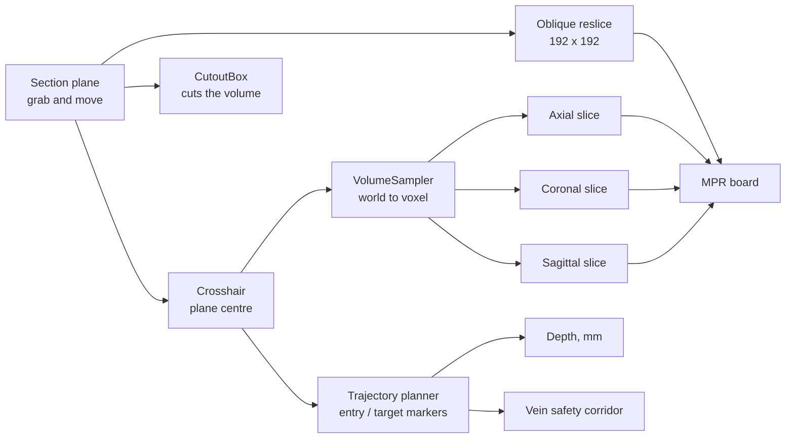

# Brain MRI section explorer

A crosshair-driven explorer for a T1 brain MRI. Move one plane through the head and the axial, coronal and sagittal slices, the oblique cut and the 3D volume all read the same point.

Built for the Navian XR Engineer challenge on top of the provided base scene. One Unity scene ships as both a desktop executable driven by mouse and keyboard, and a PCVR scene driven by Quest hand tracking.


## Why I built it this way

The brief asks for a feature that explores, visualizes or interprets the MRI. The obvious version is a viewer with one slider per axis. I did not want three sliders that each move a different thing, because that is not how anyone reads a scan.

Radiology works from a single point. You find something in one plane and you immediately want to know where that same point sits in the other two. So position became the only state in the app. There is one crosshair, it sits at the centre of a plane you can pick up and move, and every view in the scene is a different answer to the same question: what is here?

The three axis slices, the oblique cut and the cross-section of the volume are all readouts of one transform, so they cannot disagree with each other.

## What it does

- Renders the IXI025 T1 MRI as a raymarched volume (UnityVolumeRendering) with the four segmentation meshes aligned inside it
- Reslices the voxel grid into axial, coronal and sagittal images that follow the crosshair
- Cuts the volume with a plane you can move and rotate, and shows that oblique slice as a fourth image
- Keeps the cut facing you, so turning the plane around never buries the exposed face
- Shows and hides skin, gray matter, white matter and veins from a menu
- Plans a straight entry-to-target trajectory, with depth in true patient millimetres and a colour-coded warning if the track passes inside a safety corridor around a vein
- Runs on desktop with mouse and keyboard, or in PCVR with hand tracking, from the same scene

## How it works



### 1. One coordinate map

Everything that touches voxels goes through `VolumeSampler`. UnityVolumeRendering draws the dataset into a unit cube spanning -0.5 to 0.5 in its own local space, so a world point becomes a texture coordinate by inverse-transforming it and shifting by half a unit:

```csharp
Vector3 local = cube.InverseTransformPoint(world);
uvw = local + Vector3.one * 0.5f;
```

Multiply by the grid dimensions and you have a voxel index. Keeping that in one class is what stops the slice views, the cut and the volume from drifting apart, and it is the seam a label volume would plug into later.

### 2. The three axis slices

`MprScreens` fills the axial, coronal and sagittal panels from the voxel under the crosshair. The dataset is 256 x 256 x 150, so axial comes out 256 x 256 and coronal and sagittal come out 256 x 150.

The panels are sized by millimetres, not by voxel count. IXI025 voxels are 0.9375 x 0.9375 x 1.2 mm, so the scan is 240 x 240 x 180 mm and the coronal and sagittal panels are 4:3 while axial is square. Sizing them 256:150 instead squashed the head by about 22%.

Slices are raw voxel intensity mapped straight to grey; the transfer function only shapes the 3D volume. The render is an interpretation, the 2D slices are the evidence.

### 3. The oblique cut

The section plane carries a UnityVolumeRendering `CutoutBox` sized to its own rectangle, not a `CrossSectionPlane`. A plane cuts an infinite half-space, so anything on the far side of the volume disappears too. A box only removes what sits inside the rectangle you are holding, which reads like a window into the head instead of half a head going missing.

The same plane is swept to produce the oblique image, stepping through the volume with the matrix from `VolumeSampler`:

```csharp
Matrix4x4 toUVW = sampler.WorldToUVW * pose;
Vector3 rowStart  = toUVW.MultiplyPoint3x4(new Vector3(-planeSize * 0.5f, -planeSize * 0.5f, 0f));
Vector3 acrossStep = toUVW.MultiplyVector(new Vector3(step, 0f, 0f));
Vector3 downStep   = toUVW.MultiplyVector(new Vector3(0f, step, 0f));
```

The MPR board's fourth panel is that same texture, not a second sample of the volume, so the 3D cut and the 2D oblique slice can never show something different from each other.

The cutout box is also moved to whichever side of the plane you are standing on each frame, so the open face follows you around.

### 4. Structure filter

The four meshes are ground truth from the base project, so filtering them is a visibility toggle and nothing more. The menu is a rail of section tabs on the left with the selected section's contents on the right, so the panel stays one size however many sections it grows.

The meshes are segmentation; the transfer function only changes how the volume looks. Presenting a transfer function preset as if it isolated a structure would be a lie.

### 5. Trajectory planning

`TrajectoryPlanner` captures an entry and a target point from the crosshair on two button presses, draws a line between them, and reports the depth in real patient millimetres through `VolumeSampler.PatientDistanceMm`. Patient millimetres, not Unity metres, because the number that matters is how far the instrument actually travels through the patient.

The two markers are children of the volume in the scene. Grab the head and turn it, and the markers, the line and the readout move with it, the same as the meshes and the MRI do. The depth and the vein warning stay correct too: both are patient-space measurements, so they do not change just because the head was picked up and turned.

The safety corridor turns the track red if it comes within a slider-set millimetre radius of the vein mesh:

```csharp
Vector3 entryMm = sampler.WorldToPatientMm(entry);
Vector3 targetMm = sampler.WorldToPatientMm(target);
for (int i = 0; i < veinVerticesMm.Length; i++)
{
    float d = DistanceToSegment(veinVerticesMm[i], entryMm, targetMm, out float t);
    if (d < nearestMm) { nearestMm = d; nearestT = t; }
}
```

Both the track and every vein vertex go through the same millimetre conversion before the distance check. That matters because IXI025 is anisotropic, 0.9375 x 0.9375 x 1.2 mm per voxel: a single world-to-mm ratio taken along the track's own direction and then applied as a radius in every direction would be off by close to that 28% whenever the nearest vein sits off-axis from the track. Measuring both sides in the same true mm space sidesteps that instead of correcting for it after the fact.

It walks the mesh's own vertices rather than a physics query, because Unity's concave `MeshCollider` only answers raycasts: there is no `SphereCast` or overlap test that returns a correct in-range result against one.

### 6. One pointer, two rigs

Neither input path talks to the tools directly. Both end up driving a Meta Interaction SDK `RayInteractor`, which needs exactly two things: a transform to aim, and an `ISelector` that says when a click happened. A hand ray supplies a wrist pose and a pinch. On desktop, `MousePointer` supplies a screen ray and a mouse button:

```csharp
Ray ray = viewer.ScreenPointToRay(Input.mousePosition);
transform.SetPositionAndRotation(ray.origin, Quaternion.LookRotation(ray.direction));

if (Input.GetMouseButtonDown(0))
    WhenSelected?.Invoke();
```

Everything downstream of the interactor, the buttons, the hover tints, the menus, cannot tell the two apart. `DesktopMode` reads `XRSettings.isDeviceActive` at startup and switches one rig on and the other off.

Panels also carry an inert `RayInteractable` over their whole face. It does nothing when selected, but it gives the pointer something to land on, so the ray stays lit while you travel between buttons instead of blinking off over the gaps. On the MPR board that same backdrop also carries `MouseGrabExempt`, so a desktop click on the images reads as pointing, not grabbing. Everywhere else, an empty click on a panel is a deliberate handle: it drags the panel, or on the section plane, sections the volume.

## Running it

### Desktop

Download the build and run `NavianChallenge.exe`, or open the project in Unity `6000.4.0f1`, open `Assets/NavianChallenge/Scenes/NavianChallenge_Main.unity` and press Play. No headset needed. The scene detects that there is no XR device and starts the desktop rig.

| Input | Action |
| - | - |
| Right-drag | Look around |
| W A S D, arrows | Move |
| Q / E | Down / up |
| Shift | Move faster |
| Wheel | Forward / back |
| Left-click | Press a button |
| Left-drag | Move a panel or the head |
| Wheel while dragging | Push away / pull closer |
| Shift while dragging | Rotate instead of move |
| F | Reset the view |
| H | Hide the on-screen controls |

Start by dragging the section plane into the head. The oblique panel is black until the plane meets the volume. The **Plan** tab (next to **Filter** on the main menu) holds the trajectory tool: Set entry and Set target capture the crosshair's current position, and a slider sets the vein safety-corridor diameter.

### PCVR (optional)

The XR path targets Quest over Link or Air Link, not standalone. Connect the headset, start Link, then press Play. Turn your left palm towards your face to bring up the wrist menu, which shows and hides the three tools. Buttons take a poke or a point and pinch. Panels are grabbed with either hand.

### Building it

Build target is Windows x64, Built-in pipeline, and the only scene in the build list is `NavianChallenge_Main`. `File > Build Settings > Build`. The player is set to open windowed at 1600 x 900 and is resizable.

## Repo layout

```
Assets/NavianChallenge/
  Scenes/NavianChallenge_Main.unity   the whole app
  Data/Atlas/IXI025/                  MRI (.nii.gz) + 4 segmentation meshes
  Scripts/
    AtlasSceneController.cs           base project's orbit camera, superseded by Desktop/DesktopViewer.cs
    Core/                             works the same regardless of input rig
      VolumeSampler.cs                 world to voxel, the shared coordinate map
      SectionPlane.cs                  binds the cutout, reslices the oblique image
      MprScreens.cs                    the three axis slices + the shared oblique texture
      TrajectoryPlanner.cs             entry/target depth and the vein safety corridor
      CorridorSlider.cs                drag slider for the corridor diameter
      StructureToggles.cs              mesh visibility
      VolumeStyle.cs                   transfer function applied at runtime
      AtlasVolumeLoader.cs             builds the MRI volume at runtime (base project)
    UI/                               interaction primitives both rigs consume
      MainMenu.cs                      sectioned menu (rail on the left, content on the right)
      ButtonSignal.cs                  one press event from poke or ray
      ButtonVisual.cs                  hover and press tint
    Desktop/                          only meaningful without a headset
      DesktopMode.cs                   picks the rig at startup
      DesktopViewer.cs                 desktop camera and on-screen controls
      MousePointer.cs                  screen ray + click, as an ISelector
      MouseGrab.cs                     press and drag panels with the mouse
      MouseGrabExempt.cs               marks a surface MouseGrab should never pick up as a handle
    XR/                               only meaningful with a headset
      WristAnchor.cs                   wrist pose from joint geometry, palm-facing reveal
      WristMenu.cs                     shows and hides the three tools
  Shaders/
    PanelFrame.shader                 SDF rounded frame, stereo instanced
    TrajectoryLine.shader             unlit line drawn on top of the anatomy
  Editor/                             base project's scene-building tools, see note below
Assets/ThirdParty/UnityVolumeRendering/
docs/BASE_README.md                   the original base-project README
```

Panels, menus and their frames are authored as real objects in the scene. Scripts hold behaviour only and reference what the scene already contains. Building the UI from code would have meant editing C# to nudge a label 2 mm, which is the wrong tool for that job. The one exception is the two slice textures (`MprScreens`, `SectionPlane`): their pixels come from voxel data, so there is nothing to author.

`Editor/ChallengeSceneBuilder.cs` is the base project's tool for procedurally rebuilding `AtlasRoot` from the raw `.obj`/`.nii.gz` assets. It predates everything in this README and is not something this project's workflow depends on. Do not re-run it: it rebuilds the anatomy root from scratch and would discard the alignment and any scene edits made since.

## Technical decisions

**All world to voxel maths in one class.** Slice extraction, the oblique reslice and the cut all read `VolumeSampler`. When registration and region labels land later, they sample the label volume through the same class and everything stays consistent by construction.

**Nearest-neighbour sampling, not trilinear.** A slice is a texture lookup per pixel and the volume is only 150 slices deep, so nearest neighbour is fast and honest about the source resolution. It does mean the images go blocky when you push a panel close to your face.

**A bounded cutout box, not an infinite plane.** Explained above. A plane also cannot show a cut that only affects the region you are pointing at.

**PCVR, not Quest standalone.** Volume rendering is raymarching, which is fragment-bound and takes many 3D texture samples per pixel. Stereo doubles the views and raises the framerate target at the same time. On a standalone Snapdragon GPU that is a research-grade optimisation problem. Over Link the desktop GPU renders and the existing budget still holds.

**The section plane is the only handle.** There is no separate crosshair object to lose. Moving the thing that cuts is the same gesture as moving the thing that measures.

**Explicit sorting orders on the transparent panels.** Unity sorts transparent geometry by distance to camera, which is unreliable when a panel's backing, image, frame and text sit almost on top of each other. Each layer's draw order is set by hand instead of left to the default.

**The vein safety distance is measured in patient millimetres, not a world-unit radius.** A single scalar mm-per-world ratio taken from the track's own direction and applied isotropically would be wrong on an anisotropic scan. Converting both the track and every vein vertex into the same true mm space through `VolumeSampler` sidesteps the anisotropy instead of correcting for it.

**Two colour systems, kept apart.** Panel chrome uses a navy/steel/blue palette pulled from Navian's own site. The axial/coronal/sagittal frames use the conventional radiology coding, green/red/blue, and the mesh and trajectory-safety colours are anatomical and status colours. Branding the medical conventions would have made them wrong.

## Known limitations

- **No region naming.** The plan was an offline atlas registration producing a label volume plus a `regions.json`, so the app could name the structure under the crosshair and move the crosshair to a named region. It is not built. The coordinate seam it would attach to is.
- **Meshes are not clipped by the section plane.** The volume is cut, the meshes render straight through the cut. They need a matching clip plane in their own shader.
- **You cannot click inside a 2D slice to move the crosshair.** The panels are readouts only, so navigation is always through the plane. This is the single biggest gap against a real MPR viewer.
- **No window/level control on the slices.** Intensity is mapped straight to grey across the full range of the scan.
- **The 2D panels do not draw the mesh contours.** A real planner outlines the segmentation on every slice.
- **Reslicing runs on the main thread.** A 192 x 192 oblique reslice is recomputed on every plane move. It holds a comfortable framerate at this resolution, but it does not scale to a larger scan or a bigger panel.
- **The wrist menu needs hand tracking.** With controllers in hand it does not appear. The buttons themselves still work by ray.
- **One spatial layout for both builds.** Panel positions were tuned for a standing headset user, and the desktop camera starts where that user's head would be. It works, but a desktop-first layout would put the tools closer together.
- **The section plane starts outside the volume**, so the oblique panel is black until you drag the plane into the head.
- **The vein safety check measures to the nearest mesh vertex, not the nearest point on the mesh surface.** A track that pierces a face between two sparse vertices could read as clear when it actually isn't. Fine on this vein mesh's vertex density at the default 3 mm corridor, but it is a vertex approximation, not a true surface distance.

## What I would add next

In the order I would actually do them:

1. **Click in a slice to move the crosshair.** Cheapest thing on this list and it closes the largest gap. The panels already know their own voxel mapping.
2. **Offline atlas registration.** Register a labelled atlas (Harvard-Oxford) into IXI025's native grid with ANTsPy or SimpleITK, emit `IXI025_labels.nii.gz` on the same affine plus a `regions.json` of names, synonyms and centroids. Unity samples labels as a second volume through `VolumeSampler`. This stays out of Unity: registration is slow, iterative and much better tooled in Python, and the JSON is a seam that lets registration quality improve later without touching app code.
3. **An LLM agent to move the crosshair.** With `regions.json` in place, an agent resolves a typed or spoken request, "show me the left ventricle", "go to the thalamus", against region names, synonyms and descriptions, then moves the crosshair to the matched centroid. The interesting part is robust request understanding, not string equality: an agent handles synonyms, typos and compound descriptions a lookup table can't.
4. **Clip the meshes with the same plane.** One clip plane uniform in the mesh shader, fed from the same transform that drives the cutout.
5. **Window/level and trilinear sampling** on the 2D panels, which is what makes slices actually readable in a clinical viewer.
6. **Move reslicing off the main thread**, either to a compute shader or the job system, so the panel resolution stops being a framerate decision.

## Credits

Base scene, MRI and segmentation meshes from the Navian XR Engineer challenge starter project, documented in [docs/BASE_README.md](docs/BASE_README.md). Volume rendering by [UnityVolumeRendering](https://github.com/mlavik1/UnityVolumeRendering). Dataset is IXI025 from the [IXI brain dataset](https://brain-development.org/ixi-dataset/). XR input from the Meta XR All-in-One SDK.
